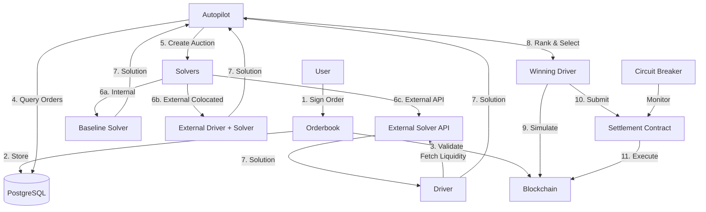

## System Overview

CoW Protocol Services implements a distributed batch auction system for decentralized trading. The architecture separates concerns between order management, auction coordination, solution computation, and on-chain settlement, enabling horizontal scaling and solver competition.

## High-Level Architecture

The system follows this flow:



### Architecture Diagram Explanation

1. **User submits order** → Orderbook validates and stores in PostgreSQL
2. **Autopilot queries orders** → Creates auction every ~12-15 seconds
3. **Auction sent to solvers** → Multiple solver types compete:
   - **Colocated**: External partners run their own driver + solver
   - **Non-colocated**: CoW runs driver, solver provides solutions via API
   - **Internal**: Baseline and other built-in solvers
4. **Solutions returned** → Autopilot ranks by execution quality
5. **Winner selected** → Driver simulates and submits to chain
6. **Settlement executes** → Smart contract performs all trades atomically
7. **Circuit breaker monitors** → Ensures solvers behave correctly

## Core Components

### Orderbook

**Role**: User-facing API and order validation

**Responsibilities**:
- Expose HTTP API for order submission and queries
- Validate EIP-712 signatures on incoming orders
- Check order viability (balance, approval, expiration)
- Store orders in PostgreSQL
- Provide quotes and fee estimates
- Filter invalid orders based on blockchain state
- Serve open orders to autopilot

**Technology**:
- HTTP server: Axum
- Database: PostgreSQL via sqlx
- Blockchain: Alloy (Ethereum library)

**Scaling**:
- Multiple orderbook instances can run concurrently
- Each connects to the same PostgreSQL database
- Horizontally scalable to handle high API traffic

**API Documentation**: [api.cow.fi/docs](https://api.cow.fi/docs/)

**Source**: `crates/orderbook/`

### Autopilot

**Role**: Protocol orchestrator and auctioneer

**Responsibilities**:
- Drive the protocol forward on a schedule (~12-15 second intervals)
- "Cut" auctions by determining boundaries and included orders
- Filter orders for validity (balance, approval, on-chain state)
- Apply fee policies to orders
- Send auction data to all configured solvers
- Collect solutions from drivers
- Rank solutions based on objective value (execution quality, gas costs)
- Select the winning solution(s)
- Instruct winning driver to submit on-chain
- Store auction and settlement data to database

**Technology**:
- Async runtime: Tokio
- Database: PostgreSQL via sqlx
- Blockchain: Alloy

**Single Instance**:
- Only one autopilot runs per network
- Acts as the central coordinator for the protocol

**Source**: `crates/autopilot/`

### Driver

**Role**: Liquidity aggregation and settlement execution

**Responsibilities**:
- Receive auctions from autopilot
- Fetch liquidity from multiple sources:
  - On-chain AMMs (Uniswap, Balancer, Curve, etc.)
  - Aggregator APIs (1inch, 0x, etc.)
  - Custom liquidity sources
- Forward auction to solver engine (if non-colocated)
- Receive solution from solver
- Encode solution to settlement calldata
- Simulate transaction to verify correctness
- Submit winning solution to settlement contract
- Handle transaction status and revert recovery

**Technology**:
- HTTP server: Axum (receives auctions from autopilot)
- HTTP client: Reqwest (calls external solver APIs)
- Blockchain: Alloy

**Deployment Models**:
- **Non-colocated**: CoW runs driver, solver is external API
- **Colocated**: Solver partner runs their own driver instance

**Source**: `crates/driver/`

### Solver Engine

**Role**: Pure optimization and route-finding

**Responsibilities**:
- Receive auction data (orders + liquidity)
- Compute optimal routing and matching
- Find Coincidence of Wants (CoW) opportunities
- Optimize for execution quality (surplus, gas efficiency)
- Return solution to driver

**Solver Types**:

<Tabs>
  <Tab title="Internal Solvers">
    **Baseline Solver**
    
    The reference solver implementation:
    - Finds direct CoW matches
    - Routes through single AMM hops
    - Simple but effective
    
    **Balancer Solver**
    
    Specialized for Balancer pools:
    - Smart order routing through Balancer
    - Vault integration
    
    **Source**: `crates/solvers/`
  </Tab>
  
  <Tab title="External Colocated">
    External partners run their own solver infrastructure:
    - Full control over solver logic
    - Run their own driver instance
    - Direct submission to autopilot
    - Full responsibility for solution quality
    
    Examples: Advanced solver teams with proprietary algorithms
  </Tab>
  
  <Tab title="External Non-Colocated">
    External solver APIs called by CoW's driver:
    - CoW handles liquidity fetching
    - CoW handles simulation and submission
    - Solver focuses only on optimization
    - Lower operational burden
    
    Examples: 1inch, 0x, Paraswap integrations
  </Tab>
</Tabs>

**Technology**:
- Can be implemented in any language
- Communicates via HTTP JSON API
- Must conform to solver API specification

### PostgreSQL Database

**Role**: Persistent storage and shared state

**Stored Data**:
- **Orders**: User orders with signatures and metadata
- **Quotes**: Pre-submission price quotes and fee estimates
- **Auctions**: Historical auction data and included orders
- **Settlements**: Executed settlements with transaction hashes
- **Competition**: Solver competition results and rankings
- **App Data**: Order metadata and hooks (IPFS references)

**Access Patterns**:
- **Orderbook**: Writes orders, reads for API queries
- **Autopilot**: Reads valid orders, writes auctions and settlements
- **Database migrations**: Schema evolution via sqlx

**Scaling**:
- Supports multiple concurrent orderbook instances
- Single autopilot reads/writes auction state
- Indexed for efficient order querying by status, user, etc.

**Source**: `database/` (migrations and schemas)

### Circuit Breaker

**Role**: Protocol safety and solver accountability

**Responsibilities**:
- Monitor on-chain settlements
- Compare executed trades to auction outcomes
- Detect solver misbehavior:
  - Incorrect execution prices
  - Missing trades
  - Unauthorized trades
- Jail misbehaving solvers
- Alert operators of anomalies

**Implementation**:
- Monitors blockchain events
- Cross-references with database auction records
- Automated solver disqualification on violations

## Order Lifecycle

Let's trace a complete order through the system:

<Steps>
  <Step title="Order Creation">
    1. User creates order in CoW Swap UI (or via API)
    2. Order includes: tokens, amounts, limits, expiration, fees
    3. User signs order with EIP-712 signature (off-chain, no gas)
    4. Order submitted to orderbook API
  </Step>

  <Step title="Order Validation">
    1. Orderbook verifies signature
    2. Checks user has sufficient balance
    3. Checks user has approved settlement contract
    4. Validates order isn't expired
    5. Stores order in PostgreSQL with status "open"
  </Step>

  <Step title="Auction Creation">
    Every ~12-15 seconds:
    
    1. Autopilot queries database for open orders
    2. Re-validates orders against current blockchain state
    3. Applies fee policies (protocol fees, partner fees)
    4. Creates auction with valid orders
    5. Stores auction to database
  </Step>

  <Step title="Solver Competition">
    In parallel:
    
    1. Autopilot sends auction to all configured solvers
    2. Drivers fetch current liquidity from various sources
    3. Solver engines compute optimal solutions
    4. Solutions returned to autopilot within time limit
  </Step>

  <Step title="Solution Ranking">
    1. Autopilot receives solutions from multiple solvers
    2. Calculates objective value for each solution:
       - Execution quality (user surplus)
       - Gas costs
       - Risk factors
    3. Ranks solutions
    4. Selects winning solution(s)
  </Step>

  <Step title="Settlement Execution">
    1. Autopilot instructs winning driver to submit
    2. Driver simulates transaction to verify correctness
    3. Driver submits transaction to settlement contract
    4. Driver monitors transaction status
    5. Transaction mined in 2-3 block window
  </Step>

  <Step title="On-Chain Settlement">
    Settlement contract executes:
    
    1. **Pre-interactions**: User hooks, approvals
    2. **Transfer in**: Pull sell tokens from users
    3. **Main interactions**: Execute AMM swaps, transfers
    4. **Transfer out**: Send buy tokens to users
    5. **Post-interactions**: User hooks, callbacks
    
    All steps are atomic - either all succeed or all revert.
  </Step>

  <Step title="Post-Settlement">
    1. Orderbook observes settlement event
    2. Updates order status to "filled" (or "partially filled")
    3. Circuit breaker verifies correct execution
    4. Data stored for analytics and API queries
  </Step>
</Steps>

## Auction Mechanism

### Batch Auction Design

CoW Protocol uses **batch auctions** instead of continuous trading:

**Benefits**:
- **MEV Protection**: No single transaction can be frontrun
- **Uniform Prices**: All users in a batch get the same clearing price
- **CoW Opportunities**: Opposing orders can match directly
- **Gas Efficiency**: Multiple trades in one transaction

**Auction Frequency**:
- Currently: ~12-15 seconds
- Target: Every block (~12 seconds on Ethereum)
- Configurable per network

### Solver Competition

**Why Competition?**
- Ensures best execution through market forces
- Prevents single point of failure
- Enables innovation in routing strategies
- Aligns incentives (better solutions = more rewards)

**Ranking Criteria**:
1. **User surplus**: Execution quality vs. limit price
2. **Gas costs**: Lower gas = better score
3. **Risk**: Penalize solutions likely to revert
4. **Slippage**: Prefer tighter execution

**Solver Rewards**:
- Winning solver earns protocol fee portion
- Payment in ETH from protocol treasury
- Incentivizes high-quality solutions

## Settlement Process

### Settlement Contract Flow

The settlement contract executes all trades atomically:

```solidity
// Simplified settlement flow
function settle(
    IERC20[] tokens,
    uint256[] clearingPrices,
    Trade[] trades,
    Interaction[] interactions
) external {
    // 1. Execute pre-interactions
    executeInteractions(interactions.pre);
    
    // 2. Transfer tokens in from users
    for (trade in trades) {
        transferFrom(trade.sellToken, trade.owner, trade.sellAmount);
    }
    
    // 3. Execute main interactions (swaps)
    executeInteractions(interactions.main);
    
    // 4. Transfer tokens out to users
    for (trade in trades) {
        transfer(trade.buyToken, trade.owner, trade.buyAmount);
    }
    
    // 5. Execute post-interactions
    executeInteractions(interactions.post);
}
```

**Interactions**:
- **Pre**: Approvals, oracle updates, custom user hooks
- **Main**: AMM swaps (Uniswap, Balancer, etc.), aggregator calls
- **Post**: User callbacks, cleanup, notifications

### Transaction Submission

**Submission Window**: 2-3 blocks from auction creation

**Failure Handling**:
- **Simulation fails**: Solution rejected, auction re-run
- **Transaction reverts**: Driver retries with backup solution
- **Timeout**: Auction expires, orders return to orderbook

**Gas Price Strategy**:
- Dynamic gas estimation based on network conditions
- Priority fees to ensure timely inclusion
- Solver pays gas upfront, reimbursed from protocol

## Multi-Chain Deployment

### Independent Deployments

Each supported chain has its own:
- PostgreSQL database
- Orderbook API
- Autopilot instance
- Driver instances
- Settlement contract

**No Cross-Chain State**:
- Orders on Ethereum don't interact with Arbitrum orders
- Each network operates independently
- Same codebase, different configuration

### Network-Specific Configuration

**Chain Parameters**:
```toml
# Example configuration
chain_id = 1
node_url = "https://eth.llamarpc.com"
settlement_contract = "0x9008D19f58AAbD9eD0D60971565AA8510560ab41"
auction_duration = 15  # seconds
block_time = 12  # seconds
```

**Supported Networks**:
- Ethereum (1): Deepest liquidity, highest gas costs
- Gnosis (100): Fast, cheap, good for small trades
- Arbitrum (42161): L2 scaling, lower fees
- Base (8453): Growing ecosystem
- Polygon (137): Broad adoption
- More: Linea, BNB, Ink

## Data Flow

### Read Paths

**User Queries Order Status**:
```
User → Orderbook API → PostgreSQL → Response
```

**Autopilot Reads Orders**:
```
Autopilot → PostgreSQL → Filter → Create Auction
```

**Driver Fetches Liquidity**:
```
Driver → Uniswap API → Cache → Solver
Driver → Balancer API → Cache → Solver
Driver → 1inch API → Cache → Solver
```

### Write Paths

**User Submits Order**:
```
User → Orderbook API → Validate → PostgreSQL
```

**Autopilot Stores Auction**:
```
Autopilot → Create Auction → PostgreSQL → Send to Solvers
```

**Settlement Execution**:
```
Driver → Blockchain → Settlement Contract → Events → Database
```

## Technology Choices

### Why Rust?

<CardGroup cols={2}>
  <Card title="Performance" icon="gauge-high">
    Low latency critical for competitive auctions
  </Card>
  <Card title="Memory Safety" icon="shield">
    Handles user funds - correctness is paramount
  </Card>
  <Card title="Concurrency" icon="arrows-split-up-and-left">
    Tokio enables efficient async operations
  </Card>
  <Card title="Type Safety" icon="check">
    Catch errors at compile time, not runtime
  </Card>
</CardGroup>

### Why PostgreSQL?

- **ACID transactions**: Critical for order consistency
- **Rich querying**: Complex order filtering and joins
- **Mature ecosystem**: Reliable, well-understood
- **Horizontal reads**: Multiple orderbook instances

### Why Alloy?

- **Modern Ethereum library**: Successor to ethers-rs
- **Type-safe contracts**: Generated Rust bindings
- **Efficient encoding**: Fast ABI encoding/decoding
- **Async-first**: Integrates with Tokio

## Performance Characteristics

**Orderbook**:
- Handles 100+ requests/second per instance
- Sub-100ms API response times
- Horizontally scalable

**Autopilot**:
- Auctions every 12-15 seconds
- Processes 100+ orders per auction
- Solver timeout: 5-8 seconds

**Driver**:
- Fetches liquidity from 10+ sources in parallel
- Simulation time: 1-2 seconds
- Submission time: 1-3 blocks

## Security Considerations

### Order Validation

- **Signature verification**: EIP-712 typed data
- **Replay protection**: Chain ID and settlement contract in signature
- **Balance checks**: Verify user has funds
- **Approval checks**: Verify user approved settlement contract

### Solver Accountability

- **Simulations**: All solutions simulated before submission
- **Circuit breaker**: Monitors actual vs. expected outcomes
- **Slashing**: Misbehaving solvers lose stake and access
- **Transparency**: All settlements on-chain, verifiable

### Database Security

- **SQL injection**: Parameterized queries via sqlx
- **Access control**: Database credentials restricted
- **Encryption**: Connections over TLS
- **Backups**: Regular automated backups

## Monitoring and Observability

### Logging

- Structured JSON logs via `tracing`
- Dynamic log level adjustment via UNIX socket
- Aggregated to centralized logging (Victoria Logs)

### Metrics

- Prometheus metrics exposed on all services
- Dashboards in Grafana
- Key metrics:
  - Orders per second
  - Auction duration
  - Settlement success rate
  - Solver performance

### Tracing

- Tokio-console support (playground only)
- Heap profiling with jemalloc
- Performance profiling tools

## Next Steps

<CardGroup cols={2}>
  <Card title="Quickstart" icon="rocket" href="/quickstart">
    Run the services locally
  </Card>
  
  <Card title="Development Guide" icon="code" href="/development/setup">
    Start contributing to the codebase
  </Card>
  
  <Card title="API Reference" icon="book" href="/api/orderbook">
    Integrate with the Orderbook API
  </Card>
  
  <Card title="Solver Service" icon="puzzle" href="/services/solver">
    Learn about solver integration
  </Card>
</CardGroup>

## Further Reading

- [CoW Protocol Documentation](https://docs.cow.fi/) - Protocol concepts and design
- [Settlement Contract](https://github.com/cowprotocol/contracts) - Smart contract source code
- [Solver Specification](https://docs.cow.fi/cow-protocol/reference/apis/solver) - Solver API details
- [Research Papers](https://cow.fi/research) - Academic publications on batch auctions

<Info>
  For questions about the architecture, join the [CoW Protocol Discord](https://discord.com/invite/cowprotocol) or open a [GitHub Discussion](https://github.com/cowprotocol/services/discussions).
</Info>