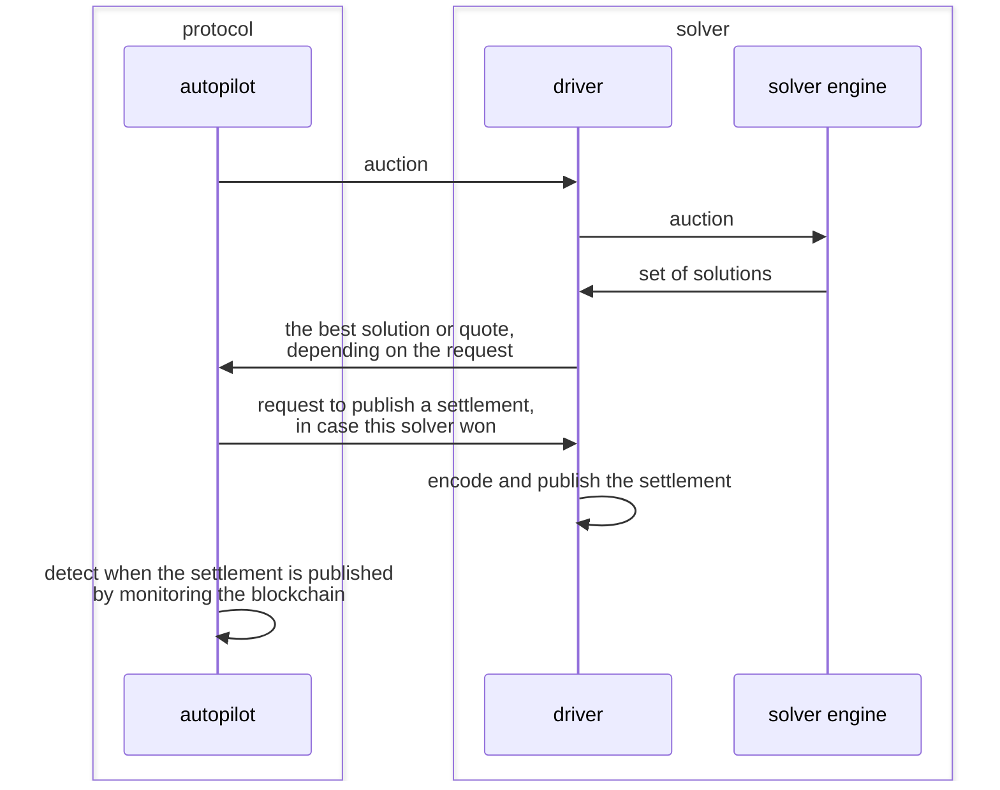

The **Driver** service is the execution layer between solver engines and the blockchain. It handles everything except the core route-finding logic: fetching liquidity, encoding solutions to calldata, simulating settlements, and submitting transactions on-chain.

## Purpose and Responsibilities

The Driver provides a standardized interface for solver engines:

- **Liquidity Fetching**: Collects on-chain liquidity from DEXes (Uniswap, Balancer, etc.)
- **Solution Encoding**: Converts high-level solutions into settlement contract calldata
- **Simulation**: Validates solutions before submission using Tenderly, Enso, or node simulation
- **Transaction Submission**: Manages gas pricing, nonce handling, and tx broadcast
- **Mempool Integration**: Monitors transaction status and handles replacements
- **Quote Generation**: Provides price quotes based on solver solutions

<Info>
The Driver-Solver architecture separates concerns: **Solvers** focus on route-finding algorithms, while **Drivers** handle all blockchain interactions.
</Info>

## Solution Execution Flow

From `crates/driver/README.md`, the interaction follows this sequence:



### Request Flow

<Steps>
  <Step title="Receive Auction">
    Driver receives auction from Autopilot via `POST /solve`
  </Step>
  
  <Step title="Fetch Liquidity">
    Driver gathers current on-chain liquidity for relevant tokens
  </Step>
  
  <Step title="Forward to Solver">
    Auction + liquidity sent to configured solver engine(s)
  </Step>
  
  <Step title="Collect Solutions">
    Solver engines return proposed solutions
  </Step>
  
  <Step title="Encode & Score">
    Driver encodes solutions to calldata and calculates objective values
  </Step>
  
  <Step title="Simulate Best">
    Top solution(s) simulated to verify execution
  </Step>
  
  <Step title="Return to Autopilot">
    Best solution returned with score
  </Step>
  
  <Step title="Execute Winner">
    If solution wins, driver receives `POST /settle` and submits transaction
  </Step>
</Steps>

## Liquidity Fetching

The Driver collects on-chain liquidity from multiple DEX protocols:

### Supported Liquidity Sources

From `crates/driver/example.toml`:

<CodeGroup>
```toml Uniswap V2
[[liquidity.uniswap-v2]]
preset = "uniswap-v2"  # or "sushi-swap", "honeyswap", etc.

[[liquidity.uniswap-v2]]  # Custom configuration
router = "0x7a250d5630B4cF539739dF2C5dAcb4c659F2488D"
pool-code = "0x96e8ac4277198ff8b6f785478aa9a39f403cb768dd02cbee326c3e7da348845f"
```

```toml Uniswap V3
[[liquidity.uniswap-v3]]
preset = "uniswap-v3"
graph-url = "https://api.thegraph.com/subgraphs/name/uniswap/uniswap-v3"
max_pools_to_initialize = 100
```

```toml Balancer V2
[[liquidity.balancer-v2]]
preset = "balancer-v2"
graph-url = "https://api.thegraph.com/subgraphs/name/balancer-labs/balancer-v2"
pool-deny-list = []  # Optional: pools to exclude
```

```toml Swapr
[[liquidity.swapr]]
preset = "swapr"
```
</CodeGroup>

### Base Tokens

Define tokens that can appear as intermediate hops:

```toml
[liquidity]
base-tokens = [
  "0xDEf1CA1fb7FBcDC777520aa7f396b4E015F497aB",  # COW
  "0x6B175474E89094C44Da98b954EedeAC495271d0F",  # DAI
]
```

### CoW AMMs

Include CoW Protocol AMM pools:

```toml
[[contracts.cow-amms]]
factory = "0x86f3df416979136cb4fdea2c0886301b911c163b"
helper = "0x86f3df416979136cb4fdea2c0886301b911c163b"
```

## Simulation and Settlement

### Simulation Options

The Driver supports multiple simulation backends:

#### 1. Ethereum Node (Default)

Simulates using the configured Ethereum RPC:

```rust
Simulator::ethereum(eth.to_owned())
```

- ✅ No additional configuration
- ✅ Accurate gas estimation
- ⚠️ Slower than specialized simulators

#### 2. Tenderly

High-performance simulation with debugging features:

```toml
[tenderly]
url = "https://api.tenderly.co/api/v1"
api-key = "YOUR_API_KEY"
user = "your-username"
project = "your-project"
save = false
save-if-fails = true
```

- ✅ Fast simulation
- ✅ Detailed execution traces
- ✅ Automatic failure debugging
- ⚠️ Requires Tenderly account

#### 3. Enso

Specialized simulation for complex DeFi interactions:

```toml
[enso]
url = "http://localhost:8454"
network-block-interval = "12s"
```

- ✅ Optimized for DeFi protocols
- ✅ Fast execution
- ⚠️ Requires Enso service

### Simulation Tuning

Optimize simulation behavior:

```toml
disable-access-list-simulation = true  # Skip access list generation
disable-gas-simulation = "45000000"    # Use fixed gas limit
```

### Settlement Encoding

Driver converts solutions to settlement contract calldata:

```rust
// Settlement executes:
// 1. Pre-interactions (incl user pre-hooks)
// 2. Transfer sell tokens in
// 3. Main interactions (swaps/routing)
// 4. Pay out buy tokens
// 5. Post-interactions (incl user post-hooks)
```

## Transaction Submission

### Gas Price Management

From `crates/driver/example.toml`:

```toml
[submission]
gas-price-cap = "1000000000000"  # Maximum gas price in wei
```

### Mempool Configuration

Configure multiple mempools for transaction submission:

```toml
[[submission.mempool]]
url = "https://your.custom.rpc.endpoint"
name = "custom_name"                   # Optional
max-additional-tip = "5000000000"      # Optional: max extra tip
additional-tip-percentage = 0.05       # Optional: 5% extra tip
mines-reverting-txs = true             # Whether node mines failed txs
```

**Mempool features:**

- Multiple submission endpoints for redundancy
- Automatic gas price adjustment
- Transaction replacement logic
- Nonce management
- Reorg handling

### Account Management

Solvers can use different accounts for submission:

```toml
[[solver]]
name = "mysolver"
account = "0x0000000000000000000000000000000000000000000000000000000000000001"

# Or use address for externally-managed key
# account = { address = "0x1234..." }
```

<Warning>
Private keys in config files should be encrypted or managed via secret management systems in production.
</Warning>

## Configuration Options

### Command-Line Arguments

From `crates/driver/src/infra/cli.rs`:

| Argument | Environment Variable | Default | Description |
|----------|---------------------|---------|-------------|
| `--addr` | `ADDR` | `0.0.0.0:11088` | HTTP server address |
| `--log` | `LOG` | `warn,driver=debug` | Log filter |
| `--ethrpc` | `ETHRPC` | Required | Ethereum RPC URL |
| `--ethrpc-max-batch-size` | `ETHRPC_MAX_BATCH_SIZE` | `20` | RPC batch size |
| `--ethrpc-max-concurrent-requests` | `ETHRPC_MAX_CONCURRENT_REQUESTS` | `10` | Concurrent RPC calls |
| `--config` | `CONFIG` | Required | Path to TOML config |

### Configuration File Structure

Complete example from `crates/driver/example.toml`:

<CodeGroup>
```toml Solvers
[[solver]]
name = "mysolver"
endpoint = "http://0.0.0.0:7872"
absolute-slippage = "40000000000000000"  # 0.04 ETH
relative-slippage = "0.1"                # 10%
account = "0x0000...0001"                # Private key
merge-solutions = true                   # Combine solutions
response-size-limit-max-bytes = 30000000

[solver.request-headers]
authorization = "Bearer YOUR_TOKEN"
```

```toml Contracts
[contracts]
gp-v2-settlement = "0x9008D19f58AAbD9eD0D60971565AA8510560ab41"
weth = "0xC02aaA39b223FE8D0A0e5C4F27eAD9083C756Cc2"
balances = "0x3e8C6De9510e7ECad902D005DE3Ab52f35cF4f1b"
signatures = "0x8262d639c38470F38d2eff15926F7071c28057Af"
flashloan-router = "0x0000000000000000000000000000000000000000"
```

```toml Order Priority
[[order-priority]]
strategy = "creation-timestamp"

[[order-priority]]
strategy = "external-price"

[[order-priority]]
strategy = "own-quotes"
max-order-age = "1m"
```

```toml Transaction Settings
tx-gas-limit = "45000000"

[submission]
gas-price-cap = "1000000000000"
```
</CodeGroup>

## Colocated vs Non-Colocated Solvers

From CLAUDE.md architecture description:

### Colocated Solvers

**External partners run their own driver + solver:**

```
┌─────────────────────────┐
│ Partner Infrastructure  │
│  ┌────────┐  ┌────────┐ │
│  │ Driver │──│ Solver │ │
│  └────────┘  └────────┘ │
└─────────────────────────┘
```

- ✅ Full control over infrastructure
- ✅ Can optimize driver for specific solver
- ✅ Keep solver logic private
- ⚠️ Must maintain driver version
- ⚠️ Responsible for settlements

### Non-Colocated Solvers

**We run the driver, configured with solver API:**

```
┌───────────────┐      ┌──────────────────┐
│  Our Driver   │─────▶│ Partner Solver   │
└───────────────┘      │ (API endpoint)   │
                       └──────────────────┘
```

- ✅ CoW Protocol handles driver maintenance
- ✅ Simplified partner integration
- ✅ Protocol manages settlements
- ⚠️ Solver must expose HTTP API
- ⚠️ Less infrastructure control

<Info>
Non-colocated is recommended for new solvers. It reduces operational burden and lets partners focus on algorithm development.
</Info>

## Running the Service

### Basic Setup

<Steps>
  <Step title="Create Configuration">
    Create a `driver-config.toml` file with your solver(s) and liquidity sources
  </Step>
  
  <Step title="Run Driver">
    Start the service:
    ```bash
    cargo run --bin driver -- \
      --addr 0.0.0.0:11088 \
      --config /path/to/driver-config.toml \
      --ethrpc https://mainnet.infura.io/v3/YOUR_KEY
    ```
  </Step>
  
  <Step title="Verify">
    Check health:
    ```bash
    curl http://localhost:11088/metrics
    ```
  </Step>
</Steps>

### Docker Deployment

```dockerfile
FROM ghcr.io/cowprotocol/services:latest

COPY driver-config.toml /config.toml

CMD ["driver", \
     "--addr", "0.0.0.0:11088", \
     "--config", "/config.toml", \
     "--ethrpc", "${ETHRPC_URL}"]
```

### Environment Configuration

```bash
export ADDR=0.0.0.0:11088
export CONFIG=/path/to/config.toml
export ETHRPC=https://mainnet.infura.io/v3/YOUR_KEY
export LOG="info,driver=debug"
export USE_JSON_LOGS=true

cargo run --bin driver
```

## API Endpoints

### POST /solve

Receive auction and return solutions:

```json
{
  "id": "123456",
  "orders": [...],
  "tokens": {...},
  "liquidity": [...]
}
```

**Response:**
```json
{
  "solutions": [
    {
      "id": "1",
      "trades": [...],
      "score": "1000000000000000000"
    }
  ]
}
```

### POST /settle

Execute winning solution:

```json
{
  "solution_id": "1",
  "auction_id": "123456"
}
```

**Response:**
```json
{
  "tx_hash": "0xabc123...",
  "status": "submitted"
}
```

### POST /quote

Generate quote for trading:

```json
{
  "sell_token": "0x...",
  "buy_token": "0x...",
  "amount": "1000000000000000000",
  "kind": "sell"
}
```

<Info>
See the OpenAPI documentation at `/docs` endpoint for complete API reference.
</Info>

## Monitoring and Debugging

### Metrics

Prometheus metrics available:

- `driver_solve_duration_seconds` - Time to process /solve requests
- `driver_simulation_duration_seconds` - Simulation latency
- `driver_settlement_submissions` - Settlement submission attempts
- `driver_liquidity_fetch_duration_seconds` - Liquidity fetch time

### Logging

Structured logs with trace IDs:

```bash
export LOG="warn,driver=debug,driver::infra::solver=trace,shared=debug"
```

### Tenderly Integration

If using Tenderly simulator:

```toml
[tenderly]
save-if-fails = true  # Auto-save failed simulations
```

Failed simulations appear in Tenderly dashboard with full execution traces.

## Performance Optimization

<CardGroup cols={2}>
  <Card title="RPC Batching" icon="layer-group">
    Batch multiple RPC calls:
    ```bash
    --ethrpc-max-batch-size 50
    ```
  </Card>
  
  <Card title="Concurrent Requests" icon="bolt">
    Increase parallelism:
    ```bash
    --ethrpc-max-concurrent-requests 20
    ```
  </Card>
  
  <Card title="Liquidity Caching" icon="database">
    Pre-initialize pools:
    ```toml
    max_pools_to_initialize = 200
    ```
  </Card>
  
  <Card title="Simulation" icon="flask">
    Use Tenderly for speed:
    ```toml
    [tenderly]
    url = "..."
    ```
  </Card>
</CardGroup>

## Troubleshooting

### Solver Connection Failures

Check solver endpoint is accessible:
```bash
curl http://solver-endpoint:7872/health
```

### Simulation Failures

Review simulation logs and verify:
- Token allowances
- Sufficient balances
- Valid solution encoding
- Gas limits

### Transaction Submission Errors

Common issues:
- Nonce conflicts (check mempool state)
- Gas price too low
- Insufficient ETH for gas
- Smart contract reverts

### High Latency

Optimize:
1. Increase RPC batch size
2. Use Tenderly for simulation
3. Reduce liquidity sources
4. Enable request compression

## Related Services

- [Autopilot](/services/autopilot) - Sends auctions to Driver
- [Solver](/services/solver) - Computes solutions for Driver
- [Orderbook](/services/orderbook) - Provides market data
